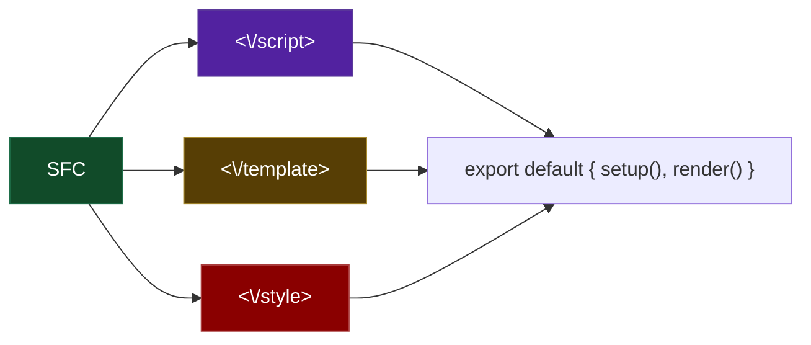
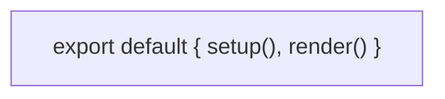

```mermaid {theme: 'dark', look: 'handDrawn'}
flowchart LR
  %% Nodes
  A[SFC]:::sfc
  B[<\/script>]:::script
  C[<\/template>]:::template
  D[<\/style>]:::sty
  E["export default { setup(), render() }"]:::cmp

  A --> B
  A --> C
  A --> D
  B --> E
  C --> E
  D --> E


  %% Styling / spacing (helps make it look closer to the original)
  classDef sfc fill:#114B29,stroke:#1f6f4a,stroke-width:1px,color:#ffffff;
  classDef template fill:#573E05,stroke:#a98b2e,stroke-width:1px,color:#ffffff;
  classDef script fill:#5222A0,stroke:#5b3a9a,stroke-width:1px,color:#ffffff;
  classDef sty fill:#8A0000,stroke:#a93b3b,stroke-width:1px,color:#ffffff;
  style E text-wrap:nowrap,white-space:nowrap
```

```mermaid {theme: 'dark', look: 'handDrawn'}
flowchart LR
  E["export default { setup(), render() }"]:::cmp
  style E text-wrap:nowrap,white-space:nowrap
```

