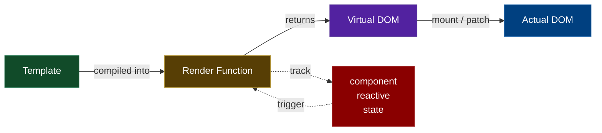

<div class="flex flex-row gap-2">

<div class="flex-1">

```vue{*}{class: 'code-lg'}
<template>
  <div class="text-center">
    <h1>{{ message }}</h1>
  </div>
</template>

<script setup>
const message = 'Привет, Vue 3!'
</script>
```
</div>

<div v-click="1" class="flex-1">

```js{*|*|1,3}{class:'code-lg'}
const message = "Привет, Vue 3!";

const _hoisted_1 = { class: "text-center" };

function render() {
  return h("div", _hoisted_1, [
    h("h1", null, _toDisplayString(message))
  ]);
}
```

</div>

</div>

<div class="pt-16" v-click="1">



</div>
