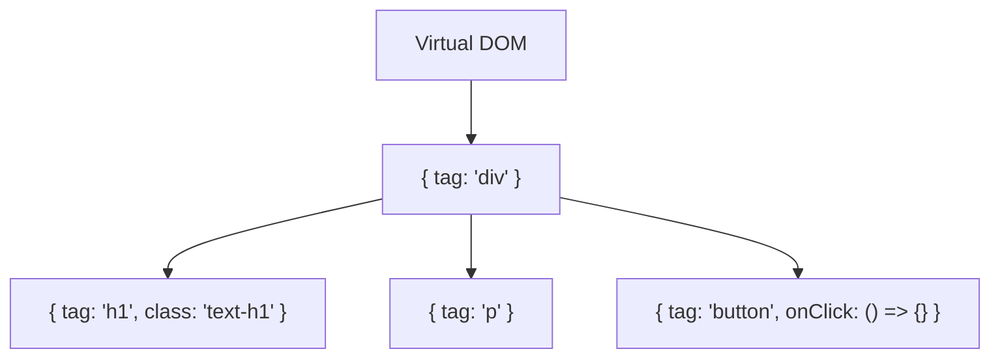

# Что такое Virtual DOM

<v-click>
Virtual DOM — это копия настоящего DOM, которая хранится в памяти...
</v-click>

<v-click>

{width=500px}

</v-click>

```mermaid {theme: 'dark', scale: 0.8}
graph TD
  A2["Virtual DOM"]
  A2 --> B2["{ tag: 'div' }"]
  B2 --> C2["{ tag: 'h1', class: 'text-h1' }"]
  B2 --> D2["{ tag: 'p' }"]
  B2 --> E2["{ tag: 'button', onClick: () => {} }"]
  style E2 text-wrap:nowrap,white-space:nowrap
```

